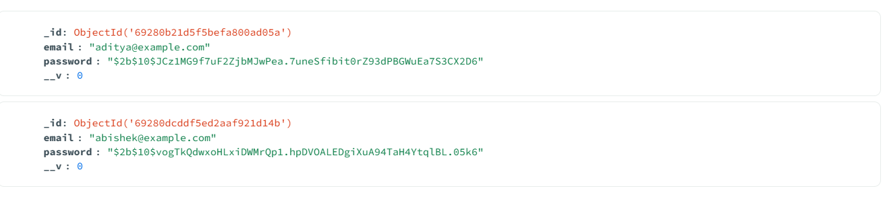
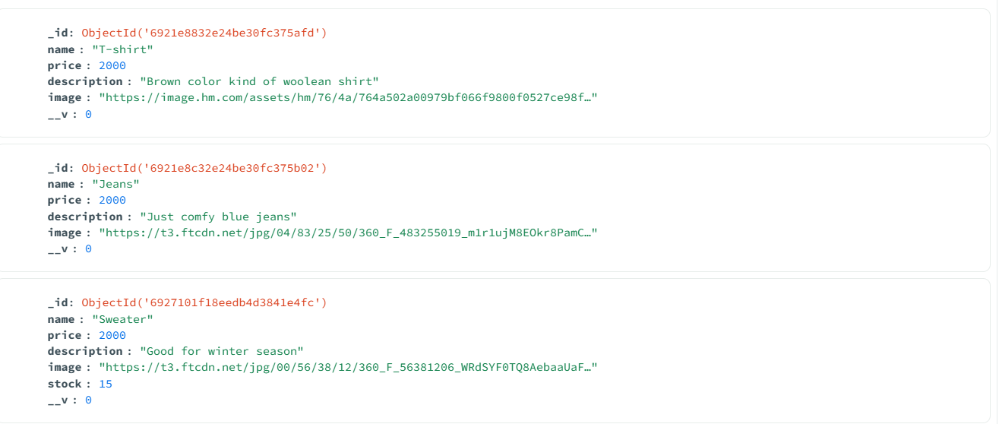
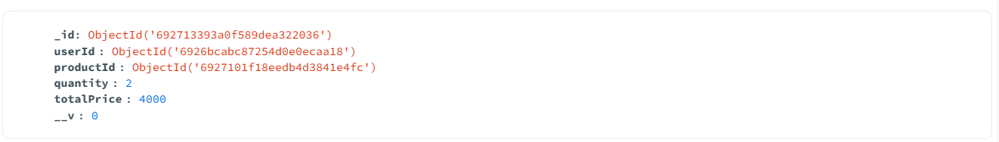

# ShoppyGlobe E-Commerce API
# ShoppyGlobe E-Commerce API

A RESTful API for a simple e-commerce application built using Node.js, Express, and MongoDB. This project supports user registration/login, product management, and a shopping cart with JWT-based authentication.

---

## Table of Contents

- [Features](#features)  
- [Technologies Used](#technologies-used)  
- [Setup Instructions](#setup-instructions)  
- [API Endpoints](#api-endpoints)  
- [Validation & Authentication](#validation--authentication)  
- [Notes](#notes)

---

## Features

- User registration and login with JWT authentication


- Password hashing with bcrypt

Hashing of password

- Product Get all products and product by id operations




- Shopping cart CRUD operations (Add, Update, Remove, Get Cart Items)

Add to cart

Add to cart mongoDB


Cart for specific user logged in


Edit cart item


Delete cart item

- Input validation and error handling


- Logging of requests (HTTP method, URL, status code)

---

## Technologies Used

- Node.js  
- Express.js  
- MongoDB with Mongoose  
- JWT (JSON Web Token) for authentication  
- bcryptjs for password hashing  
- Postman or ThunderClient for API testing

---

## Setup Instructions

1. **Clone the repository**:
```bash
git clone https://github.com/anistars/shoppyglobe-e-commerce-application-backend.git
cd backend-shoppyglobe-e-commerce
```
2. **Install node modules**:
```bash
node install

```
3. **Run with using nodemon or node "index.js"**

